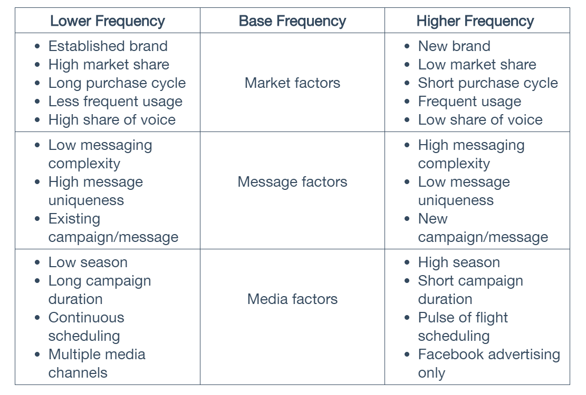
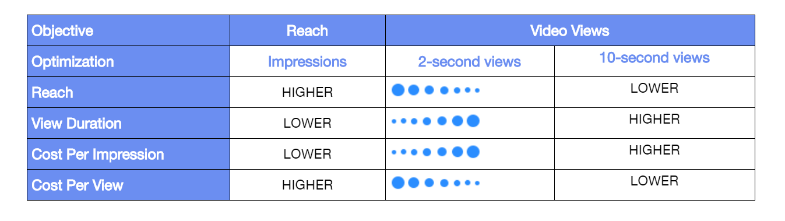
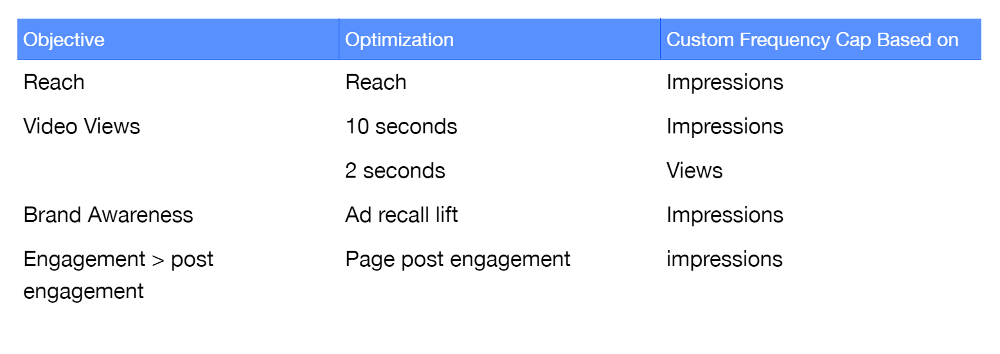
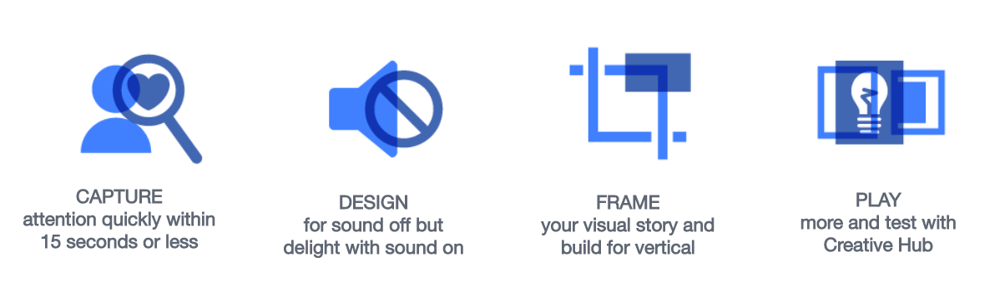

## Facebook Planning Professional Study Guide
The Planning Professional exam measures competency in managing, creating, and purchasing ads, ad buying types, improving performance delivery via the ad auction, troubleshooting ad issues, and mapping ad formats to ad objectives. And, it covers audience targeting, Facebook reporting, mapping KPIs to buying objectives, and understanding and testing the Facebook Pixel and SDK.

### Objective 1: Define Advertising Objectives (Weight: 20%)
#### 1.01 - Establish whether the advertising objective is a brand, direct response, or both.

*Supporting courses*:  
**How to Drive Actions Online, in Stores, and in Mobile Apps**  
As you plan for your Facebook campaign, be mindful of:
1. Your business goals
2. Your target audience
3. How do you measure and track results

The answers to these questions will define your overall strategy and help you measure the effectiveness of your campaigns across Facebook, Instagram, Messenger, and Audience Network, alongside other marketing channels.

**Facebook Pixel and SDK**  
To capture the people who visit your website, have installed or launched your mobile app or have purchased your products or services, implement the Facebook Pixel & Facebook SDK. They enable you to measure, optimize and build audiences for your ad campaign. You don't need to implement both, but by doing so you can measure cross-device behavior.

The pixel and SDK each allow you to:
1. Optimize delivery to people likely to take action. They ensure your ads are seen by people most likely to take the action you want (e.g. make a purchase or fill out a form)
2. Automatically build audiences to reach again after they've visited your site or app. Create Custom Audiences so you can retarget people who take specific actions on your website (e.g. visiting a product page), and automatically send relevant ads to them.

**Ad Buying Types**
1. Auction
2. Reach and Frequency
3. TRP buying

**Auction**  
Advertiser Bid * Estimated Action Rates (likelihood of driving a desired outcome) + User Value (website performance, ad quality, ad relevance) = Total Value  
To get the most out of advertising on Facebook, try to maximize all factors:
* Bid the max you're willing to pay
* Create compelling advertising
* Target to the right audience

| | Auction | Reach & Frequency |
|---|---|---|
| Availability | All advertisers | Limited Availability |
| Frequency Control | NA | Flexible frequency cap for any interval (e.g. 5 per 3 days) |
| Delivery Control | Standard. Facebook will auto-identify the highest performing ad | Standard + sequenced or scheduled delivery that controls the dates/order on which people see the ads |
| Predictability | Daily reach predictions only | Prediction is given for reach, frequency distribution, spend per day and placement distributions before purchase is placed |
| Prices | Depends on the auction | After order placement, the CPM will remain constant |
| Optimization | Only optimized for the campaign objective | Optimizes for Reach first, then the campaign objective |
| Targeting | Can target multi-country audiences. Suited for small audience. Can exclude dynamic audience | Can only target 1 country at a time with minimum audience of 200,000 people. Cannot exclude dynamic audience |
| Objectives | All objectives available | Brand Awareness, Reach, Traffic, Post Engagement, App Installations, Video Views, Conversions |
| Placement | All placements available | Facebook News Feed OR Facebook & Instagram Feed OR Facebook Right-Hand Column |
| Creatives | All creatives available | All creatives, except 360 photos and 360 videos |

**Ad Objectives**  
Objectives marked with an asterisk are available through both Auction and Reach Frequency.  
1. Demand Generation (Traffic\*, Video Views\*)
2. Customer Acquisition (Lead Generation, Conversions\*, App Installs\*)
3. Transactions (Conversions, Product Catalog Sales, Store Visits)

*Note*: Both Customer Acquisition and Transactions have Conversions as one of their objectives, and one is available through both Auction and Reach & Frequency. This is taken from [Facebook Blueprint](https://www.facebookblueprint.com/uploads/resource_courses/targets/360438/original/index.html#/page/5b2bbeeaf8100e6c94103af8).

**Choosing the Audience**
1. Core audiences  
Create a target audience based on the information people share with Facebook: **location, demographics, interests and behaviors** (you can filter for these audience attributes). Core Audiences help you reach a broad audience with interests relevant to your business goals.  
2. Custom audiences  
Enables you to connect with your most valuable audiences. It's a key targeting capability to reach existing customers and prospective customers. You can get audience data from CMS, website, mobile app (through Facebook Pixel / SDK), or other sources to target Facebook ads to people you already know.  
With Custom Combinations, you can build rules and layer on customizations to only include visitors of specific pages. Segment audiences by pages visited, time spent, frequency of their visits, device used, and more.  
You can also identify and reach people who have viewed a video, engaged with an Instant Experience or started filling out your lead ad form.  
You can also remarket to people who abandoned their shopping cart with messaging that drives them back to complete the purchase.
3. Lookalike audiences  
Allows you to reach new people who share similar characteristics with customers who've expressed interest in your business. You do this by selecting a seed audience (e.g. a Custom Audience from your website), the country or region for your lookalike audience, and audience size.

*Be mindful of audience overlap.*  
Audience overlap means multiple ad sets are delivering to audiences that contain the same people. Overlapping audiences is not necessarily a bad thing, but it can lead to poor delivery of your ad sets. The ad auction tries to avoid showing too many ads to the same person from a single advertiser over a short time period, so audience overlap might explain why some ad sets aren’t hitting their full budgets.

If you find that there’s audience overlap, we recommend the following:  
* Consolidate your overlapping ad sets. If some ad sets are targeting very similar audiences, you could see better results by consolidating them into one with a larger budget.
* Refine your targeting. Take advantage of location, age, gender, interest and/or behavior-based targeting to ensure each ad set has a specific and distinct audience. You can also try creating separate Custom Audiences or lookalike audiences for each ad set.

**Measure Campaign Outcome**
1. Audience Outcomes - Measure and optimize how you reach your audiences.
  * How many people did your ads reach? How frequently?
  * Did the ads reach the intended people/audience?
  * Did the ads reach people across devices?

2. Brand Outcomes - Measure how your media spend impacts brand objectives.
  * Did the ads break through? Are they memorable?
  * Did they generate brand awareness?
  * Did the ads change the perception of your brand?

3. Sales Outcomes - Measure how your media spend impacts sales objectives.
  * Did the ads drive your business outcomes? Did they contribute to ROI?
  * Did the ads result in sales, leads or app installs?

Facebook offers a variety of solutions that can be used to gauge the sales outcomes.
1. Facebook ads reporting  
Measures online and offline conversions based on people-based metrics for ads served on Facebook, Instagram, and Audience Network.  
2. Facebook Conversion Lift  
Measure the true impact Facebook ads have on the people you reach. Determine the additional business driven online, offline, or in your mobile app from people reached by Facebook ads across devices.
3. Partner Lift  
Can provide you with either:
  * Lift measurement using your first-party data hosted within third-party data environments, and using the Facebook lift platform for setup.
  * Lift measurement for using grocery and retailer transaction data. It's primarily for consumer packaged goods (CPG) brands.
4. Multi-Touch Attribution (MTA) partners  
Gain a better understanding of the ROI across publishers, including on desktop and mobile, nd make more accurate investment decisions across all media and channels.
5. Marketing Mix Modeling (MMM) partners  
Facebook enables partners to better measure and compare the effectiveness of your marketing channels based on contribution to sales, efficiency and ROI.
6. Mobile Measurement Partners (MMPs)
More accurately measure your Facebook mobile app ad campaigns, making it easier to understand how Facebook drives installs and revenue for your app compared to other ad networks.

**Brand Best Practices**  
Understand your audience so you can improve your targeting and create campaigns that strike a chord with them.

**Insights**  
Facebook IQ is the place to go to access our insights offerings of studies and tools designed to help you create campaigns that resonate with your audience.  

**Audience Insights**:  
One of the Facebook's recommended insights solutions  is Audience Insights. This powerful tool gives you access to audience data that can deepen your understanding of who your audience is and what matters to them. The insights you surface can help inform your campaign's audience, messaging and creative execution and ultimately help you create campaigns that deliver results.

Within Audience Insights, you can view aggregate, anonymized information about two groups of people:
1. People connected to your Facebook page
2. People on Facebook

You can view aggregated data that includes their:  
* Demographics
  * Age & gender
  * Relationship Status
  * Education Level
  * Job Role
* Page likes
  * Top categories
  * Page Likes
  * Relevance - the pages most likely to be relevant to your audience based on affinity, Page size and the number of people in your audience that already like that Page
  * Audience - the # of people in your audience that like the relevant Page
  * Facebook - the # of people who like the relevant Page in the same countries as your selected audience
  * Affinity - how likely your audience is to like a given Page compared to everyone on Facebook
* Location - shows the top cities, countries and languages of your selected audience in comparison to the entire Facebook population in your country.
* Activity - shows the median number of actions your audience has taken over the last 30 days, including Page likes, comments, post likes, post shares, promotion redeemed, devices they use to access Facebook, and ads clicked on.

**Note**:
- If you want to view insights for only your Page in Audience Insights, you must have the Page role of Advertiser, Moderator, Editor or Admin.
- If you want to view insights for all of Facebook in Audience Insights, you need an ad account on Facebook.
---
*Other resources*:  
**Advertising Objectives**  
When you create an ad, you first choose your objective. The objective you choose aligns with your overall business goals:
* Awareness: Brand Awareness, Reach
* Consideration: Traffic, Lead Generation, App Installs, Engagement, Video Views, Messages
* Conversions: Store Visits, Conversions, Catalog Sales

---
#### 1.02 - Select the most appropriate Facebook campaign objective, form of buying, and/or type of creative.
*Supporting courses*  
**Brand Awareness: Earning Reach and Attention (Building Brand Awareness with Ads)**  
The Brand Awareness objective is designed to increase ad recall. The Estimated Ad Recall Lift (people) metric shows how many people Facebook estimates would remember seeing your ad if they're asked within 2 days.  
Many factors determine the success in a brand campaign:
* Impact: Deliver the right ad to the right person at the right time.
* Reach: Convey your message to a significant amount of your target audience.
* Creative: Resonate with your target audience.
* Connection: The results of a campaign will vary depending on the existing strength of your product and brand's equity.

You need to set your target audience, as well as your placements, budget, and schedule (**reach**), and then build your ad (**creative**). Next, the system works within these parameters to optimize for ad recall lift automatically (**impact**). There will always be some degree of random behavior and unpredictability when it comes to human behavior (**connection**) and this affects the consumer response to your ad.

Within your target audience, Facebook will show your ad to the people Facebook thinks will later recall seeing it as a result of seeing your campaign. These people are chosen based on:
* Behavior: The actions that people have taken, their demographics, and the likelihood of them interacting with your ad. For every type of campaign, Facebook uses **signals** to drive delivery. Signals are data-based insights such as how a person relates to similar brands, what they like and who they follow.
* Polling: Facebook constantly run polls on a random sample of campaigns each day that ask people if they recall an ad.

Brand Awareness campaign optimizes cost per impressions (CPM), so you will be billed by impressions.

**Measure Your Impact**  
Find the Estimated Ad Recall Lift (EARL) metric column in Ads Manager.  
1. When your campaign doesn't meet the criteria to conduct a full brand polling study, this is an accessible alternative to measure ad recall.
2. Use it to compare the effectiveness of different creative executions or target audiences. You can add the metric *Cost per Estimated Ad Recall*. Don't compare the EARL between campaigns because the material differs across the campaigns (running at different times and possibly targeting different target audiences).
3. Get a real-time estimation of campaign success.
4. Complement other measurement solutions like Facebook Brand Lift, Nielsen Brand Effect, or Millward Brown Digital: Brand Lift Insights.
---
**Achieving Scale with Reach Objective**  
Goal: to maximize your campaign's unique reach over its lifetime.  
Example: Suppose you're a retailer that wants to hold an online flash sale over a three-day holiday weekend. You can make your target audience aware of this event by using the Reach objective to maximize the campaign’s unique reach over your sale weekend and the days leading up to it.  
You can also use the Reach objective to maximize how often people see your ads in a given time period. Let’s say you are targeting a narrow audience, and you want to increase the likelihood they see your ad. In this case, it makes sense to use the Reach objective to expose them to the ads more often.  
Even though you may get greater lift with granular targeting, your outcome will probably yield less impact than if you had targeted a broader audience.  
When measuring campaigns for total impact, a larger audience reach will often be more successful than a smaller audience.

Two options for Optimization for Ad Delivery: **Reach (Recommended)** (will be served to maximum number of people) and **Impressions** (deliver ads to people as many times as possible)  
**Reach** is optimized for unique reach over the campaign lifetime, while **Impressions** is optimized for daily reach. In **Reach**, you can also customize the # of days that must pass before someone sees your ad again (Frequency Cap). Research shows that up to 2 impressions a week can drive results.  
*Note:* It's currently not possible to change the frequency period once you apply it to an ad set. Also, when you pause your campaign, the frequency cap will reset and the frequency cap interval will start over again when you resume your campaign.

Q: What happens when the Reach objective is combined with the Reach and Frequency buying?  
A: It should result in the highest reach available within this type of buying as Facebook optimizes 100% towards most efficient reach available. This is possible because this optimization goes after pure reach rather than blending reach with the underlying performance goal. As a result, you should expect to see **lower CPMs** that reach the same percentage of an audience than you would using another objective.

*Note*: Reach optimization in an auction will usually have a more efficient CPM than reach optimization in a reach and frequency buy with identical budget, creative, targeting.

You can display a call-to-action (CTA) button on your ad. When people click the CTA button on your ad, you can prompt them to take an action, such as calling your business, or direct them to a destination like a "contact us" page. Some CTAs can only be used with certain placements.
* "Call Now" only works with mobile placements including Instagram and mobile News Feed.
* "Send Message" only works with Facebook mobile and desktop News Feeds since your audience will be prompted to use the Messenger app to communicate.
---
**Traffic Objective**  
This objective helps drive your audience to your website, app, or Messenger where they can then further engage with your business. This type of ad seeks to reach people in the "consideration" stage of their consumer journey; these people are either actively looking for products like yours, or open to learning about them.  
Because Traffic ads are designed to drive people to your designated destination, they are, by default, optimized to get you the most link clicks.

Various use cases for traffic ads:
1. Clicks on Facebook Offer --> Lands on your website
2. Driving your ad traffic to Facebook Messenger to interact with your audience one-on-one through conversation
3. Re-engage people who matter to your business (through Custom Audience)
4. Spark interest by using an Instant Experience (IX)

If you want people to land on your website after clicking your ad, choose **Website** as your ad's destination.  
Available placements:
* Facebook (News Feed, Right-Hand column, Instant Articles, Marketplace, Stories)
* Instagram (Feed, Stories)
* Audience Network (Native, Banner, Interstitial and Rewarded Videos)
* Messenger (Home)  

You can turn your ad into a Facebook Offer when your ad destination is Website  
Ads linking to Messenger are served in Facebook and Instagram feeds and Messenger Home.

Instant Experience is a fast-loading, fullscreen experience designed for smartphones. It supports user interactions with its content, such as zoom and tilt-to-view. Ads that include Instant Experience are served in Facebook Stories and Instagram Stories.

---
**App Installs**  
To increase mobile app installs and engagement, and to access Facebook's full spectrum of measurement and reporting tools for app ads, your app needs to be registered. To do this, a Facebook developer account needs to be created. A personal Facebook account can be upgraded to a developer account. Registering your app allows you to seamlessly link it to your app install campaign. It also enables you to set the cost per action (CPA) bid.

In order to get the most out of Facebook app ads, be sure you have administrator or advertiser privileges on the app you want to run ads for. This will allow you to locate the app in the drop-down menu in Ads Manager to access more measurement and reporting tools. To become an administrator or advertiser on an app, have your app developer add your account to the app.

If using a personal ad account without a Business Manager account, make sure:
* Your User ID has admin or advertiser rights on the Ad Account ID you're using. Go to the Ad Accounts page, and use one of the ad accounts in the dropdown.
* Under Business Settings, User ID is an admin or an advertiser of the App.

**Facebook SDK**  
Facebook’s software development kit (SDK) opens a wide range of powerful features to help you connect with people once they download your app. It enables you to track events or target engagement and conversions. Game developers can track events like “completed tutorial” or “achieved level” to reward players, and drive in-app purchases, while e-commerce companies can remarket to customers and run dynamic product ads (DPA).

Add the Facebook SDK to:
* Measure installs
* Measure app events
* Add deferred deep links to your ads
* Improve targeting
* Encourage purchases
* Create re-engagement ads
* Measure in-app conversions

Available formats: Image, Video, Carousel, Slideshow  
Available placements: Mobile News Feed, Instagram, Audience Network

**App Events and Optimization**  
App events allow you to measure the performance of your app using Facebook Analytics, measure conversions associated with Facebook ads, and build audiences to acquire new users as well as re-engage your existing users. Adding app events to your app reveals more about your audience and the actions they take. Use app event data to create a Lookalike Audience, made up of people who share similar characteristics with your most valuable app users.

App events enable you to:
* Understand who is using your app.
* Measure your app install ads performance.
* Reach specific sets of people who use your mobile app.
* Build Custom Audiences for ad targeting.

By enabling app events, you can use Facebook Analytics to get powerful, aggregated demographics and rich insights about people's behaviors, such as:
* How many people install or launch your app
* How often people make purchases and what they buy
* Custom events that you define

You can set up app event optimization within the Ads Manager or via the API.
1. Value optimization  
Facebook will deliver your ads so as to maximize the total purchase value generated in order to get the highest Return on Ad Spend (ROAS). Value optimization predicts how much purchase value a person may generate over a seven-day window. We use this prediction to apply a bid multiplier in the auction for that person. By bidding more for people who are likely to spend more, marketers can ensure they drive conversions that maximize purchase value rather than installs or conversions. This helps drive better return on spend for mobile app install campaigns.

2. App events
3. Video Views

**Deep links and deferred deep links**  
A deep link is a URL that points to a specific place in your app, like a product page. When used with mobile app install ads, it is called a deferred deep link because a person is taken to the app store first and then to the specific content. You can use deferred deep links or a URL with **App Links** enabled. Using a deep link requires integration with the Facebook SDK.  

**Measurement**  
1. Measure Install and In-App conversions  
Calculate your ROI: Use app events (added to cart in an ecommerce app or level achieved in a game app) to get detailed insights on how ads are adding value to your business.
You can measure:
  * Count and Value (measure the total count and value of these actions taken within your app)
  * Actions Taken (Measure the count and value of actions attributed to a specific ad campaign)

2. Ads Manager Reporting  
Get insights about the performance, audience and placement of your ads, make changes to your ads, update your payment info, control your settings, etc.

3. Mobile Measure Partners (MMP)  
A Facebook Marketing Partner specializing in mobile measurement can help you get deeper insights or measure across several ad networks. Consider working with a MMP if you want to:
  * Get deeper insights about your campaign performance
  * Measure aggregated results across several ad networks
  * Dedupe data for more accurate insights  
MMPs provide metrics like:
  * Attribution
  * Lifetime Value
  * Downstream conversions
  * ROI
  * Analysis across acquisition channels

4. Facebook Analytics  
Helps you understand how people interact with your app and which of these actions originate from your ads. Understand customer activity, how people interact with your app across devices, and which ads drove the most conversions. Get breakdowns by campaign for app installs and in-app conversions, and measure lifetime value and retention by ad campaign, ad set, or ad.

---

#### Facebook Offers
You can create an offer ad under Traffic or Conversions objective.  
Two ways to create and share Facebook Offers: through organic Page posts or paid ads.

1. Offer posts  
Offer posts created through your page look different than regular posts, but they appear in the same places. They're organically discoverable by fans and visitors. You can create offer posts for free and pay to boost them anytime.   
Boosting allows you to target delivery of offer posts beyond your own Timeline and the News Feeds of people who Like your Page.

Measurable with Page Insights: You can view reach and engagement metrics for offer posts by clicking on Insights located at the top of your Page.  

2. Offer ads  
Offers created through Ads Manager are Facebook ads. Like all ads on the platform, they are associated with a Page and a campaign, and require an ad objective, budget, and target audience.
Offer ads don’t publish to your Page, but will appear in desktop and mobile News Feeds and right column placements.

Measure offer ad performance in Ads Manager:  
Facebook provides detailed reporting for all ads, including offers. Performance metrics include: # of link clicks, people reached, and cost per result. Demographic metrics include the # of link clicks, the ad's reach and cos per result broken down by the age and gender of people who saw your ad. Placement shows the distribution of views across Facebook, Instagram, and Audience Network.

---
#### Video Views Objective
The Reach objective puts your video in front of as many people as possible, but the average view time tends to be lower. The Video Views objective reaches fewer people, but they tend to watch longer.

When creating a campaign that uses the Video Views objective, you have the flexibility of choosing a delivery optimization for your ads of either 10-second or 2-second continuous views.
* The 10-second video views optimization means that we'll deliver your ad to people more likely to watch 10+ seconds of your video. This tends to be a smaller audience.
* The 2-second continuous view optimization delivers video to an audience that is more likely to watch 2+ seconds of your video. This audience is larger, but may watch less of your overall video.

There are 3 Optimization for Ad Delivery options to determine which type of video view you want to optimize delivery for:
1. ThruPlay:  
For video ads < 15s, optimize delivery to get the most completed video plays.  
For video ads > 15s, optimize delivery to people who will play at least 15s.
2. 10-Second Video Views: Deliver to the right people to help you get the most video views of 10+ seconds at the lowest cost.
3. 2-Second Continuous Video Views: Deliver to get the most video views of 2+ continuous seconds. This is only available for mobile on the following platforms:
  * Facebook (Facebook Feeds, In-Stream Videos, Suggested Videos)
  * Instagram Feed
  * Audience Network: Interstitial and In-Stream Videos.

Different charges for different scenarios:  
1. If you have a 15-second ad, delivered with a 2-second continuous video view optimization  
You'll be charged a certain amount if a person watches at least 2 seconds continuously.  
You'll be charged a different amount if they watch for 10 seconds or longer.
2. Let's say your 15-second ad is delivered with a 10-second video view objective  
You won't be charged if a person watches for less than 10 seconds.  
You will be charged when a person watches for 10 seconds or more.
3. If you have an 8-second ad, delivered with a 2-second continuous video views optimization  
You'll be charged a certain amount if a person watches at least 2 seconds continuously.  
You'll be charged a different amount if they watch all 8 seconds; the same as a 10-second view.

---
#### Boost Your Posts
Boosting your posts increases the likelihood that:
- People will see your content in their feeds.
- People are more likely to respond to a discount / sales promotion.
- Your customers' friends might see their friends' reactions and comments on your post.

After boosting your post, you have to choose:
1. The Audience: You can target people who like your Page, people who like your Page and their friends, a default audience, or create a new audience.
2. Budget: When you select your budget, you'll see the estimated number of people you can reach for that amount. It factors in both your budget and the parameters you've set for your target audience.
3. Duration: How long you'd like to boost the post for.
4. Payment method.

Boosted post can appear on Facebook in desktop and mobile News Feeds and in the right column, and Instagram.

You can manage your boosted post(s) from either Ads Manager or Page Insights.
A business can change the budget of their boosted posts from the post itself, in Ads Manager, and in Power Editor.

---
#### Lead Generation
By default, lead ad forms are set to capture people's names and email address. If you want to gather additional information, you can require more data such as birthdate* and gender by checking the corresponding boxes during the form setup. You can also add custom, open-ended questions to help you qualify your leads or get a better understanding of their needs so you can better serve them.

*Note*: The person creating the lead ad must have either Admin or Advertiser permissions to the business Page and the lead ad must link to the business's privacy policy on their website.

*Note*: If you add birthdate field to your form, it will be visible to the people seeing this on Facebook, but not Instagram.

*Note*: If you are a Business Manager admin, you can give a person who is assigned a role on the Facebook Page associated with your lead ads access to download leads. Unless you customize who can access your leads, only Page Admins are able to access leads information.

*Note*: A business can add up to fifteen custom questions to their lead ad form.

Where you can run lead ads:
- Facebook News Feed
- Instagram
- Instagram Stories
- Instant Articles

You will have 90 days from the time people submit their information to access their data. Afterwards, they will be deleted. Facebook does not share any lead ad data with third parties.

There are 3 ways to access your lead information:
1. Customer System integration (Real time)
2. Facebook Marketing API Integration (Real time)
3. CSV File Download (Manual) (Download it from their business Page or Ads Manager)

Best Practices:
1. Pre-campaign considerations
  * Set the right bid
  * Determine the right budget
  * Implement the Facebook Pixel
2. Targeting
  * Depending on your business goals, choose your target audience appropriately. (e.g. Reach your most valuable audience by building a Custom Audience)
  *Note*: Facebook offline conversion can tie your offline data to your Facebook lead ad campaigns. Once you upload your offline data, our technology can match your data to real people in a completely anonymized way. You can then leverage these offline behaviors and attributes to build or refine your campaign audiences.
3. Creative
  * Add Instant Experience
  * Demonstrate Brand Identity
  * Offer an incentive (discount, promo codes, etc.)
4. Instant forms
  * Limit the number of questions
  * Ask the right questions

You can create an ad lead in Ads Manager.  
1. Choose the Page you'd like to use to create a lead ad.  
2. Choose your target audience, ad placements, budget, and schedule. You cannot target lead ads to people under 18 y.o.  
3. Select an ad format (carousel, single image, video, slideshow)  
4. Add your ad
5. Publish

**Retargeting**  
Once you’ve run a lead ads campaign, you can create a Custom Audience to retarget people who have previously engaged with your lead ad. Engagement Custom Audiences help you retarget people who have opened your lead ad form, opened but didn’t complete the form, and people who completed the form.

How to create Custom Audience:
1. When you're in the Audience section of ad creation, click on Create New, and select Custom Audience
2. Select Engagement on Facebook --> Instant Form
3. Select an instant form, engagement type (e.g. people who opened your form), and timeframe.
4. Create your audience

---
#### Dynamic Ads
Ideally suited for advertisers with a large inventory, dynamic ads allow you to:
- Scale your campaigns
- Deliver ads at the right time
- Reach people across devices
- Show relevant ads

Dynamic ads lets you target 2 groups of people:
* Recent visitors to your site / app (retargeting)
* Broad audiences

To create a dynamic ads campaign, you need to set up two key ingredients:
1. Facebook pixel, Facebook SDK, or both
2. Your product catalog

Instead of creating an ad for each item you sell, dynamic ads allow you to create an ad template that can be used at scale. Your ad template automatically populates images and details from your catalog.

*Note*: To provide real-time updates on pricing and available, we recommend using the Facebook Marketing API, a Facebook Marketing Partner, or an approved feed provider.

*Note*: Product sets contain a group of products you want to promote in your dynamic ad.

---
#### 1.03 - Determine Campaign KPIs
*Supporting Courses*  
**Edit and Manage Facebook Ads**  
You can duplicate existing ads, ad sets, or campaigns with all of their existing creative intact. Duplicating and modifying ad objects can help you more efficiently:
- Update an existing ad while keep the metrics for the original and new versions separate.
- A/B test creative, audiences, placements, or ad delivery optimization.
- Scale and customize campaigns, ad sets, or ads for a range of products and audiences.

Duplicating campaigns default to the same spending limit as the original, but it is editable. Duplicated ad sets include every ad in the original ad set and pull from the same budget as the original. Duplicated ads use the budget that belongs to the ad set they're placed in and won't increase your overall budget. You can opt to set a new budget at the time you create a duplicate ad set and can edit any ad set budgets at any time.

*Note*: It's not possible to edit the objective of an existing campaign, or change the objective of a duplicated campaign.  
However, advertisers may be able to duplicate existing ad sets or ads into new or existing campaigns that have different objectives than the campaigns they were originally created in.

Keep in mind the following  to avoid disruption to your ads:
- If you turn off a campaign, it'll also stop all ads and ad sets in that campaign.
- If you turn off an ad set, it will stop all the ads in that ad set.
- To turn ad delivery back on, you may need to turn on the parent ad set and campaign, too.

If you delete campaigns, ad sets and ads, you won't be able to run or restore them. Reporting data will still remain available.

At each level, you can edit:
1. Campaign - Campaign's name and spending limit. You can also change the ad objective, but this may impact ad and ad settings.
2. Ad Set - Budget, schedule, audience, placement, optimizations, delivery. You can also change objective-specific details, such as the offer connected to a conversion ad.
3. Ad - Ad name, creatives

When editing multiple  campaigns, ad sets, or ads, keep in mind that any changes you make will take  place across all campaigns, ad sets, or ads you selected. For example, if you edit two ad sets' audiences at the same time, all the ads contained in both those ad set will be delivered to the new audience.

*Note*: You can set a rule to automatically adjust ad budget based on performance.  
*Note*: It can be difficult to distinguish ad metrics from before and after an edit. Metrics from duplicated, exported, or deleted ads aren't affected by those actions. By editing an ad set, it may impact the continuity of data reporting.

---
#### Measure Results in Ads Manager
- Measures Sales, Audience and Brand outcomes
- View performance of your ads across Facebook, Instagram, and Audience Network
- Anyone with an Ads Manager account can view ad performance data

1. Audience Outcome - Measure and improve how you reach your audience (focuses on Reach & Frequency)
  * How many people did your ads reach? How frequently?
  * Did the ads reach the people you want to connect with?
  * Did the ads reach people across multiple devices?
  * Combined with other tests like Brand/Conversion Lift, it can determine your optimal reach & frequency that is required to drive your business goal.  
  * You can access Reach and Frequency metrics through ads reporting in Ads Manager or via the Ads Insights API
2. Brand Outcome - Measure how your ads impact your brand objectives (Estimated Ad Recall Lift & Reach)  
  * Did the ads break through? Are they memorable?
  * Did they generate brand awareness?
  * Did they change the perception of your brand?
3. Sales Outcome - Measure how your ads impact sales and conversions   
  * Did the ads drive purchase intent?
  * Did they contribute to ROI?
  * Did they result in sales, leads or app installs?

---
### Objective 2: Define Target Audience (Weight: 20%)
#### 2.01 - Apply procedural concepts for using the Audience and Page Insights Tools.

*Supporting Courses*  
**Introduction to Facebook Pages**  
Purpose:
- Understand the importance of creating a mobile presence for your business.
- Recognize the different ways to communicate with customers from your Page, whether it's one-on-one or through a variety of posts.
- Understand the tools available to manage and measure how well your Page is doing.

Sections let you highlight what your business offers. You can add:
1. Promote products with a **shop** section. (Shops are free to use and FB doesn't take a percentage of earnings)
2. Display services with a **services** section. This section lets you list all the services you offer.
3. Communicate job openings with a **job** section.

These sections include a call-to-action (CTA) button.

Posting from your Page is easy and works just like posting content to a personal profile. When you create a post — like a video, an offer, or a job listing — it can appear in multiple places, including:
1. Facebook News Feed
2. Facebook Search
3. Marketplace*: a place for users to find local jobs, buy tickets, and purchase products from businesses (Select countries only)
4. Local App**: a mobile app where people can discover events, businesses, and more that's powered by recommendations from friends and their local community (US only)

**Engage with your local community**
- Create Facebook events
- Create a Group and link it to your Page
- Post Jobs

or you can communicate with people one-on-one (for sensitive information)

A business can grow a vibrant community on Facebook by creating Page posts that are relevant to your target audience, create a Group, and link that Group to your business Page.

---
**Manage and Measure Results**  
A few tools:
- Facebook Pages Manager app (This free mobile app enables you view notifications, post updates , upload photos and videos, respond to comments and messages, and view Page Insights)
- Inbox (Inbox lets you view and respond to comments and messages across your Facebook, Messenger, and Instagram accounts) *Note*: You have to link your Facebook, Instagram, and Messenger accounts.
- Page Insights (Unlike personal profiles, with Pages you can actually measure how customers are engaging with your brand or business. Page Insights provides that information about Page performance — such as demographic data about your audience — as well as how customers are responding to your posts. You can also see when your audience is on Facebook and how boosted posts or promotions are doing)

You can use this information to better target your audience, by creating the types of posts they’re interested in seeing and then publishing them at the best times.

All this data is available to you on desktop by clicking on the Insights tab at the top of your Page. You can export your insights into a CSV file to organize or track data on your computer.

---
*Supporting course*  
**Audience Insights**  
Facebook Audience Insights allows you to learn more about your customer segments, whether you care about geography, demographics (age, gender, relationship status, job roles), lifestyle or all of the above. The tool helps you to **compare** the characteristics of your audience with the overall Facebook population to find out what’s unique about them.

Two types of audiences to choose from:
- People connected to your Page
- Everyone on Facebook

*Note*: The minimum audience size that you can look at is 1,000. If your audience contains fewer than that, Facebook is unable to provide insights.  
*Note*: Audience Insights displays data for people 18+ only.  
Relying on native and third-party data, Audience Insights breaks down audiences according to demographics, interests and behaviors. You can also see the most popular topics that audiences are posting about on Facebook.  
Facebook uses native data to show you audience features such as:
- Age and gender
- Relationship status
- Education level
- Job role
- Top categories
- Page likes
- Top cities
- Top countries
- Top languages
- Frequency of activities
- Device users

If you’d like to learn more about consumer attitudes and behaviors, check out Facebook IQ.

---
**Page Insights**  
In the Page Insights tab, you can find out which posts people are engaging with most, so you can make informed decisions about what content resonates best on your Page.  

**Reach and engagement**
See how many people saw your posts, as well as who liked, shared and commented on them. This will help you to learn which posts get the most attention, allowing you to create more of the content that people prefer.

**Actions**
See what actions people are taking on your Page, including whether they're going to your site or clicking on your call-to-action button. This will help you adjust your Page to encourage people to take the actions you want.

**People**
Understand your audience through demographic data such as age, gender and location. You'll also see when people are looking at your Page and how they found it – which can help you to tailor future posts.

**Views**
Discover how many people are viewing your Page and what sections they're looking at. You can use that information to target different audiences with boosted posts and ads or tailor your content to their interests.

**Posts**
See a breakdown of how each of your Facebook Page posts have performed over time. You'll see how many people each post has reached, and how many engaged through clicks and reactions – so you can quickly analyze what's working best.

You can only access data in Page Insights for the last 2 years, and demographic data, such as age, gender and location, are available in Page Insights once there is data for 100 or more people. Pages categorized as a Community Page don't have Insights.

You can use Insights to:
- Understand how people are engaging with your Page
- View metrics about your Page's performance
- Learn which posts have the most engagement and see when your audience is on Facebook
- See how many people clicked your Page's call-to-action button, mobile phone number, website or address

---

#### 2.02 - Determine the appropriate audience, based on campaign objectives
*Supporting courses*  
**Targeting: Core Audiences (Target ads using Facebook data)**  
Targeting happens at the **ad set** level, and audiences can be broken down into separate ad sets when you want to bid differently to reach each audience.  
Building a Core Audience on Facebook lets marketers calibrate ad delivery around:
- **Demographics** (education, political views, family/relationship status, life events, career, etc.)
- **Locations** (Everyone, Locals, New residents, or Visitors of a location, or geographic targeting)
- **Interests** (activities, Pages and posts they like, posts and comments they make, and closely related topics)
- **Behaviors** (reach people based on device usage and other activities)
- **Connections** (based audience engagement with your Facebook Page, Facebook Events, or app)

**Multicultural Affinity (US Only)**  
Facebook’s targeting solution is not based on ethnicity. Instead, the affinity audiences are defined by peoples' affinity to cultures they've demonstrated an interest through the behaviors on Facebook (which is why it is put under behaviors, rather than demographics).  
Specific categories such as housing, employment, and credit cannot be marketed on the basis of multicultural affinity.

**Devices and Engagement**  
You can create ads to include or exclude people by desktop browser and operating system, or by mobile device.  
You can include/exclude people from Core Audiences based on whether they engage with your Facebook Page, your apps, or your Facebook Events. You can also target or exclude friends and connections of people who have engaged with your content.

**Audience Overlap**  
Overlap means the percentage of people that are in both audiences. Overlap can become problematic if the percentage of overlap and the budgets of the overlapping ad sets are high enough, and the audiences are being used at the same time. This can cause ad sets to end up in the same auction. We don't allow ad sets from the same Page or app to compete against each other because that could lead to advertisers driving up costs on themselves. So we remove the ad set that has a worse performance history from the auction. However, if we have to remove duplicative ad sets from auctions a lot, that can reduce delivery.

This strategy not only helps create more relevant messages, but reduces targeting overlap and under delivery.

- Consolidate audiences into high percentages  of overlap into single large audiences.
- Evaluate the timing of ad sets and decide if they can be run at different times.
- Exclude similar audiences.

**Targeting: Custom Audiences (Use data from your CMS, website, mobile app, or other sources to target Facebook ads to people you already know)**  
Unlike Core Audiences, which only uses information shared with Facebook, Custom Audiences allow you to securely anonymize your own information and combine it with similarly anonymized Facebook information. This process lets you reach existing customers on Facebook and Instagram in a privacy-safe way.  
To ensure you’re delivering the right message to the right audiences, you can combine Custom Audiences with other options to reach people through Facebook, such as location, demographics, interests, behaviors, and connections.

You can generate Custom Audiences from a variety of sources.

- Customer files: Build audiences from your CRM, POS, email lists, or other sources
- Website activity: Reach existing customers and those who've shown interest in your business (need Facebook Pixel)
- Mobile app activity: Use Facebook ads to engage with people based on their interactions with your apps (need Facebook SDK)
- Facebook engagement: Reach people who've interacted with your Page, videos, lead ads and fullscreen experiences on Facebook

Facebook pixel and SDK updates in real time as people interact with your website and apps, so Custom Audiences built from these sources are more dynamic than Custom Audiences from your customer files.

You can use this information to:
- Reach people based on specific actions they’ve taken on your website or mobile app.
- Avoid spending money on advertising to people who’ve already completed specific actions.
- Remarket based on inferred intent.
- Create Lookalike Audiences of people similar to your best customers and clients.

Engagement Custom Audience is based on Facebook information only, so you won’t need to set up a pixel or SDK in order to create these Custom Audiences.

You can reach people based on how they've engaged with:

- Your Facebook Page: Deliver ads to people who viewed your Page, engaged with your posts or ads, clicked on call-to-action buttons, sent a message to your Page, or saved content from your Page.
- Videos posted to your Page: Deliver ads to people who watched a certain length or percentage of videos posted to your Page.
- Your Lead ads: Deliver ads to people who opened a form, opened a form but didn't submit it, or opened and submitted a form.
- Fullscreen mobile experiences: Deliver ads to people who interacted with a collection or Canvas experience.

**Hashing information**
1. When you begin the process to share your customer list, it's hashed locally in your browser before it's uploaded to Facebook.
2. We match the fingerprints of your hashed list against ours.
3. The matches are added to a Custom Audience for you. The matched and unmatched hashes are deleted.

The resulting Custom Audiences are stored in your ad account, where only authorized account admins can request that ads be delivered to them.

In addition to information that you provide, we can also hash pixel, SDK, CRM or transaction activity to match against a potential audience in our system.

**Additional options for creating Custom Audiences**
- Customer file: you can upload or paste the contents of a properly-formatted .txt or .csv file.
- Website traffic: needs Facebook Pixel implemented. You can specify a criteria for the customers, such as: People who searched for an item on your website in the last 14 days AND made a purchase on your website in the last 180 days. You cannot mix AND with OR statements.
- App activity: needs Facebook SDK implemented. You can specify a criteria for the customers, such as: People who completed the tutorial AND people who achieved level 2.
- Offline activity: Before your campaign begins, visit Offline Events in Business Manager to make sure an offline event set is assigned to and is responding to your ad account. As your campaign runs, upload your offline event information following our best practices, so you can see how those events are attributed to people who saw your ads.
- Engagement:
  * Dwell: Create a list of people who have spent more time than usual viewing your display ads on Facebook or Instagram.
  - Video: Create a list of people who have spent time watching your videos on Facebook or Instagram.
  - Lead Form: Create a list of people who have opened or completed a form in your lead ads on Facebook or Instagram.
  - Fullscreen Experience: Create a list of people who have opened your collection ad or Canvas on Facebook.
  - Facebook Page: Create a list of people who have interacted in some way with your Facebook business page, ranging from a simple visit to sending you a message through the page.
  - Instagram business profile: Create a list of people who have interacted in some way with your Instagram business profile, ranging from a simple visit to sending you a message through the profile.
  - Event: Create a list of people who have indicated that they are either interested in or going to an event hosted on your Facebook business page.

**Usage & Permissions**  
- You're responsible for the information that’s uploaded and used to reach your Custom Audience. That’s true even if you’re working with a partner, such as an agency, data manager, or data provider.
- You must have all necessary rights and permissions and lawful basis, to use and disclose Custom Audience information in compliance with our Custom Audience terms of service.
- If you need to share your audience information with an agency or other third parties for the sole purpose of managing your campaign, you'll need to establish a partnership with your Business Managers and you both will need to affirm compliance with our Custom Audience terms of service.

Custom Audiences can achieve business objectives such as acquisition, retention and re-engagement. For best results, use the source that aligns with your objective. For example, if you hope to increase sales, your seed audience should contain frequent shoppers or high-value clients.

---

**Targeting: Lookalike Audiences (Surface new audiences by combining Custom Audiences with Facebook targeting)**

Lookalike Audiences can help you find — and deliver ads to — people who share demographics and behaviors with your current customers.

This may simplify prospecting for new business by helping you reach the people who are most likely to be interested in your business.

You can use Lookalike Audiences to reach people who are similar to:
- Existing customers
- People who like your Facebook Page
- Visitors to your website
- People who engage with your mobile app

Why use Lookalike Audiences?
1. Streamline prospecting: Using a small, highly-effective, Custom Audience to seed a Lookalike Audience that's optimized for reach may help reveal people on Facebook who could be interested in your business but haven't yet connected with you.
2. Surface your new biggest fans: Optimize for similarity to show ads to the people most likely to love what you do or sell. This can help your budget work more efficiently.

**Lookalike Audience Size**
Lookalike Audience size
You can choose the size of a Lookalike Audience during the creation process. This size is expressed in a scale of 1-10, which is the percentage of the population of a particular country that you are asking Facebook's system to match with your seed audience.

We generally recommend a source audience with between 1,000 to 50,000 people. The quality of the source audience matters too. If a seed audience is made up of your best customers rather than all your customers, that could lead to better results.

Smaller audience (1 - 5): More closely match your source audience. (more similarity)
Larger audience (6 - 10): Increases your potential reach, but reduces the level of similarity between the Lookalike Audience and source audience.

You can create a seed audience from:
1. Existing Custom Audience
2. Your customer information
3. Your Facebook Pixel
4. A mobile app (must be Developer or Admin of the app and there must be an active SDK event tracking place).
5. Facebook Page fans

**Best Practices**
- Use highly relevant seed audiences
- Experiment with audience size
- Avoid broad Lookalike Audience sources
- Combined Facebook targeting tools (Layer on targeting options like age, gender, and interests to better understand who your potential customers and clients are. However, if your ad set is optimized for conversions, layering parameters may muddle—(rather than refine)— your targeting, since Lookalike Audiences already incorporate information like age, gender and interests from your source.)
- Audience Quality > Audience Size
- Use high-quality data
- Segment your audience
- Use expanded targeting as a backup (You may want to consider checking the Expand interests when it may increase conversions at a lower cost per conversion box during ad set creation.)

---
#### 2.03 - Distinguish between different targeting tactics
*Supporting courses*
- Targeting: Core Audiences
- Targeting: Lookalike Audiences
- Targeting: Custom Audiences

*Other resources*
- Audience Targeting Options
You can target audience based on their **Locations** ( Most objectives let you target worldwide, by region, by free trade area, or by app store availability), **Age**, **Gender**, **Languages**, **Detailed Targeting** (include/exclude audience based on their demographics, interests, and/or behaviors), **Connections** (include/exclude people based on connections to your Pages, apps, events), **Custom Audiences** (include/exclude people in a Custom or Lookalike Audience from your target audience).  
Your targeting options are the same regardless of the placements you choose.

---
#### 2.04 - In a given situation, determine how different layers of targeting can be built to complement each other.

*Other resources*
- Targeting: Lookalike Audiences
- Targeting: Custom Audiences

---
### 3. Build Plan (Weight: 36%)
#### 3.01 - Distinguish between the different buying, ad formats and objectives
*Supporting courses*  
**Engage Your Audience With Fullscreen Canvas Experience**  
Link broken

**Driving Inspiration and Product Discovery With the Collection Ad Format**  
Objective: Learn how collection can help consumers discover, learn, and buy on mobile.  
Collection is a mobile-only ad format available on Facebook that pairs a photo, video or slideshow with four product images below it in the News Feed. Clicking on this leads people to a fullscreen mobile experience showcasing multiple products, which loads within the Facebook app for a faster, seamless experience. Then, tapping on a product takes people to a product detail page on your mobile site or app.

Also, you can include a 'See more' call-to-action to take people to your website or app to browse additional products. People who land on your business's mobile site or app are high-intent potential customers who are most likely to convert. This experience helps drive brand awareness, generate interested customers, and increase purchase consideration, ultimately driving sales.

The **traffic, conversions, store visits** and **catalog sales** objectives are supported to help businesses drive awareness, customer acquisition, and product sales within a mobile-first shopping experience.

**Why use collection?**  
- Collection helps businesses tell their story, showcase products, and highlight features in one immersive ad format.
- Collection can help businesses get their most interested customers to continue to purchase on their website or app.
- Collection inspires mobile shopping and product discovery in a visual and immersive way.
- Collection can help businesses acquire new customers in an engaging way.

Collection is only available on Facebook mobile.

**How to create a collection with a Catalog (using Ads Manager)**  
Campaign Level:  
1. Select an objective that is supported by collection (Traffic or Conversions), then click Continue.

Ad Set Level:
1. If you're using the Traffic or Conversions objective, select Website or App.
Tip: If you're using an app, it's recommended that you link people directly to your products within your app.

2. Define your audience, budget, and schedule, then click Continue.

Ad Level:
1. Select the Facebook Page that represents your business.
2. Select the collection ad format.
3. In the Fullscreen Experience section, click the Create New tab.
4. Since you have a catalog, you'll want to use one of the Sell Products Templates; Grid Layout or Lifestyle Layout.
5. Tip: You can visit the Help Center for specific instructions on how to use each of the templates. If you'd like to learn more about Instant Experience, take a look at our Engage Your Audience With Instant Experience course.
6. Create your Instant Experience for the collection ad. While you create your Instant Experience, you'll see updates being made in the preview.
7. Click on the Preview on Mobile button and we'll send a full preview of the ad to your mobile device.
8. When everything looks good, click on Done. This will close the fullscreen Instant Experience Builder window.
9. In the Links section, you can add Text that will appear at the top of your ad, and a Headline that goes above the items displayed from your Catalog.
10. You can click Review to check all of the important details of the associated Campaign, Ad Set, and this Ad.
11. Click Confirm to submit your ad for approval.

**How to create a collection without Catalog (Can use Ads Manager or Power Editor)**

---
**Storytelling With the Carousel Format**  
*Note*: Photos, Videos, Slideshows, Cinemagraphs; all of these formats may be used in the carousel.
A carousel ad is a single ad that consists of multiple images or videos, or a combination of both. You can include up to 10 items per carousel, each with a unique link. These items are known as cards. The carousel format is available on Facebook, Instagram and Audience Network.

With carousel, Facebook can automatically reorder images/videos based on the audience's preference (only for ads that appear in Facebook News Feed). You can also set the ad order yourself.

There's also the option of using the carousel format with dynamic ads. With dynamic ads, advertisers can automatically promote relevant products from their catalog and showcase up to **30 products** within a single ad unit on **mobile** or up to **5 products on desktop**.

The flexibility of the carousel format gives you the opportunity to connect with customers during the different stages of a purchase, helping to move them toward conversion.

You are encouraged to use images and video that express your brand, but if you are specifically choosing to use **right column placement** for your carousel ad:

- You will need to use the Traffic, Conversions or Catalog Sales objectives.
- Your carousel can only contain images, not video.

This also means that if you use the default automatic placements, your carousel won't be shown on the right column if it doesn't fit the above requirements.

| | Facebook Carousel Ads | Instagram Carousel Ads |  
| --- | --- | --- |
| Objectives | Brand Awareness, Reach, Traffic, **Engagement**, App Installs, Video Views, **Lead Generation**, Conversions, Catalog Sales, **Store Visits** | Brand Awareness, Reach, Traffic, App Installs, Video Views,  Conversions, Catalog Sales |

Create Carousel ad from Ads Manager
*Note*: At the ad level, confirm the identity you fish to use for the ad - if you manage the Facebook and Instagram pages for multiple businesses, this is where you will select which one is sponsoring the carousel ad.

*Other resources*  
**Use the Facebook Ads Guide**  

---
#### 3.02 - Determine the key variables that can influence campaign phasing
*Supporting courses*
* Ad Auction and Delivery Overview

The Facebook ad auction is designed to maximize advertiser value and optimize the experience of consumers on Facebook, Instagram, Messenger and Audience Network.  
In general, we try to show your ads evenly throughout the day so that the people most valuable to you in your target audience are more likely to see them.

Generally, the more relevant we predict an ad will be to a person, the less it should cost for the advertiser to show the ad to that person.

The delivery system contains 3 components:
1. Auction - An auction occurs when there’s an opportunity to show someone an ad, leading advertisers to compete for this opportunity. To find the most relevant ad to show someone, we rank each ad targeting every individual. The winning ad maximizes value for both the advertiser and this person.
2. Pacing system - Our pacing system aims to maximize value over the duration of your ad set and over many, many ad opportunities.
3. Advertiser Controls - These are the advertiser inputs that guide our auction and pacing systems. These inputs include values and parameters you specify for your audience, budget, bid, placement, schedule, and optimization goals.

How to determine which ad to show?  
[Advertiser Bid] x [Estimated Action Rates] + [User Value] = Total Value

- Advertiser Bid - When you submit a bid, you're telling Facebook how much you value a certain outcome from your target audience. While your bid may be lower than what you actually pay, we recommend you determine your bid based on the cost per action (CPA) you’re willing to pay or the ROI you want to achieve.
- Estimated Action Rates - Estimated action rates represent how likely we think a given person is going to take that action. This is based on the previous actions by the person you're trying to reach has taken. Regardless of which action you choose, we convert all advertiser values to an effective cost per impression (eCPM).
- User Value (Ad quality, ad relevance) - User value is about creating the best experience for people across our communities. We consider whether someone would want to see your ad when we determine which ad will win an auction. User value captures things like ad quality, expected positive and expected negative engagement from the people in your target audience, and post-click experience.

After your ad is served > 500 times, it receives a daily relevance score between 1-10. A score of 10 means Facebook estimates your ad as being highly relevant.  
When your ad is relevant to your audience, its relevance score is higher and is more likely to be shown than other ads targeting the same audience. As a result, you pay less to reach your audience. Use the ad relevance score as an indicator that it's time to refresh or test your ads.

After an ad wins an auction based on its Total Value, the price paid for the winning ad is based on the total value lost by advertisers who competed in the same auction and lost. Because your price is based on the value lost by all of the advertisers you've displaced, and not just one bidder, this minimizes the ability for people to “game” the auction by trying to undercut any single bidder.

**Budget Pacing**  
1. Standard Delivery  
Standard delivery is designed to spend your budget evenly over the duration of the campaign using a method called discount pacing. Under this method, we essentially lower your bid to a level that will just spend your budget over the campaign duration so that you can capture more opportunities at more efficient costs.

2. Accelerated Delivery  
Accelerated delivery spends budget as quickly as possible by entering every opportunity under your bid cap into the auction. This favors quick spend over maintaining your cost per result. With accelerated delivery, it is possible to exhaust your budget before your scheduled campaign ends. Advertisers with bigger budgets who want to reach people quickly or with time-sensitive campaigns should consider using accelerated delivery.

**Ad Delivery**  
- Delivery Insights: Use this tool to understand your ad delivery or performance.
- Estimated Daily Results: This tool predicts potential results in the auction. With this knowledge, you can adjust your daily budget to see predictions for your campaign's potential reach and outcomes before committing to a budget.

**Delivery Insights**  
Use Delivery Insights when you want a comprehensive look into your ad set’s performance.  
Delivery Insights contain tabs for Activity History, Auction Overlap and Audience Saturation. Auction Overlap specifies what other ad sets within your ad account share an overlap (e.g. an audience overlap across ad sets). A high rate of overlap may be the cause of your performance issues. Audience Saturation provides data such as the percentage of your daily impressions that comes from people seeing this ad set for the first time.

**Estimated Daily Results**  
When creating or editing an ad set, you can view the estimated daily results for certain outcomes based on changes you make to budget, audience, bid amount, and placements. By understanding the daily impact of any changes you make to budget, bid, targeting, and placement, you can make more informed decisions on how to optimize your ad sets for greater impact.

In the Budget & Schedule section of Ads Manager, Estimated Daily Results provide you with these views:
- Budget Curve:  
Use this to adjust your budget and see in real time the predicted daily outcomes when editing ad sets.  
The budget curve can help you understand how predicted outcomes change with budget revisions. As you create or edit your ad set, and specify your budget, choose 'Daily Budget', and enter your desired daily investment. You will see the Estimated Daily Results curve give you a predicted outcome based on what your campaign is optimizing for.
- Slider Bar:  
Use this to adjust audience, placements, bid amounts, and budget to find out in real-time what are their predicted daily outcomes when creating or editing ad sets.  
The slider shows estimated audience size along with estimated daily reach and results based on your current ad set settings, like targeting and budget.  

Estimated Daily Results is helpful for campaigns that optimize for actions (ex: video views, conversions, and app installs). If the campaign goal is to reach audiences at scale and pricing predictability is important, you can use the Estimated Daily Reach slider bar to gauge the unique number of people you will reach in your campaign.

Note that as your ad set delivers through its scheduled duration, the incremental data will help Facebook more accurately predict how many more potential outcomes you can get in our auction.

**Conversion Optimization**  
If you're driving actions on your mobile app or website, you're likely using this optimization already.

Conversion optimization allows you to optimize your ad delivery specifically for the outcomes you care about by showing your ads to the people most likely to convert. Our conversion optimization model makes adjustments to advertiser bids to serve ads to the people most likely to convert, bidding more aggressively for these people.

This tool is ideal for driving actions on websites or mobile apps with the Facebook pixel or SDK in place, respectively.

**Under-delivering website conversion ads**  
If your conversion-optimized ad set is consistently not seeing many conversions and you've already tried optimizing for a higher-funnel event on the pixel that occurs more frequently, you can opt into a feature that *temporarily* falls back to optimizing for link clicks. Because clicks are more common than conversions, falling back to click optimization will allow for more delivery while we continue to learn more about who in your target audience is most likely to convert as a result of your ad.  
*Note*: during this period, your average conversion costs may be higher than usual because we are using automatic bidding for link clicks.

---
#### 3.03 - Determine the campaign product mix to meet campaign objectives
*Supporting courses*: Same courses as 3.01

---
#### 3.04 - Determine optimal budget allocation to meet campaign objectives.
*Supporting courses*:
- Ad Auction Delivery and Overview (covered in 3.02)
- Facebook and TV
- Reach and Frequency Buying on Facebook

*Other resource*
- How Much Do Facebook Ads Cost?

**Facebook and TV**  
Facebook and Instagram provide video advertising solutions to complement your TV campaigns.  
Target Rating Points (TRP) measure impressions as a percentage of the target population for an advertising campaign and are a core aspect of how TV ads are purchased and measured. TRP Buying on Facebook and Instagram allows buyers to purchase TRPs verified by Nielsen.* TV buyers can use this planning and buying option to purchase Facebook and Instagram video in a simple and predictable way and get guaranteed delivery against Nielsen demographic audiences.

Why TRP Buying on Facebook and Instagram?
- TV media buyers are already using TRP as a global TV measurement currency.
- Facebook’s TRP Buying solution mirrors the process advertisers currently use to purchase TV and video ads from traditional media.
- Easy process for TV buyers to purchase video ads to extend their TV campaigns.
- The solution will include Nielsen Digital Ad Ratings on each campaign, which will give you third-party verification of on-target impressions.

**Requirements**  
Please also keep in mind that campaigns using TRP Buying must follow the requirements below:

- Minimum spend: Please contact your Facebook rep to find out the latest minimum spend requirement.
- Targeting: Available in Nielsen markets including Australia, Brazil, Canada, France, Germany, Indonesia, Italy, Mexico, Philippines, Thailand, UK, and US. Dayparting is available globally, while targeting based on designated marketing area (DMA) is only available in the US.
- Timelines: Campaigns must be confirmed at least seven days prior to launch.
- Creative assets: Creative must be in a video format. Creative can be changed after 48 hours. However, creative rotations and weightage cannot be guaranteed.
- Availability: TRP Buying is currently available in Australia, Brazil, Canada, France, Germany, Indonesia, Italy, Mexico, Philippines, Thailand, UK, and US.

**Reach and Frequency Buying on Facebook**  
Reach and frequency buying works well for brands that want to reach a wide audience (at least 200,000 people) (but only one country per campaign) and want to know their costs and delivery expectations upfront. For example, fast moving consumer goods like soda and snack foods or advertising agencies who service clients and need to exhaust their budgets within a predictable period of time.

Reach and frequency buying isn’t great for campaigns with small target audiences (fewer than 200,000 people) or small budgets. We don't recommend reach and frequency to advertisers who target local areas because the minimum audience tends to be too large for that type of campaign. We also don't recommend this buying type for advertisers who want the most cost-efficient direct response outcome, like conversions or app installs.

Compared to Auction Buying type, Reach and frequency buying can give you more predictability and control over the following:  
- Reach and CPM
- Frequency
- Spend per day
- Placement distribution (e.g., Instagram vs. Facebook)

We recommend using reach and frequency buying with **exposure-based objectives** like **Reach, Brand Awareness, and Video Views**. For example, if you want people to watch your video or be more aware of your brand, we recommend using the reach and frequency buying type.

We don't recommend using reach and frequency buying with **action-based objectives** like **Traffic, Catalog Sales, and App Installs**. In other words, if you want people to buy something from your website or install your app, the auction buying type might be a better option.

*Note*: Ads cannot run in the Right Column and in Mobile or Desktop News Feed at the same time.

You can create campaigns that range from 1-90 days and can schedule them up to six months in advance. The cost is always CPM (cost per 1,000 thousand impressions)

Choose between standard, sequenced and scheduled delivery

| | Best When | How it works | Limitation |
|---|---|---|---|---|
| Standard | Your creative message doesn't need to be delivered in any particular order or on any particular date.| The system will deliver a single or multiple-ad campaign based on the best-performing ad.| You don't control the order in which people see your ads or the date the ads are delivered.|
| Sequenced | You want to deliver multiple ads in a certain order to tell a coherent story (for example, no one will see ad 2 of your series unless they see ad 1 first).| You choose the order in which you want people to experience your ads.	| Delivery is based on login behavior so we can't guarantee that people who see the first ad in your series will see the ones that follow. |
| Scheduled | You want to deliver a message that relates to the day it's delivered (like the final day to shop a sale or the series premier of a new TV show).	| You choose the date when you want people to experience your ads. | 	People might not see the complete series of ads. |

Set a frequency cap (max no. of times your ad will be delivered to someone within a given period of time). Generally, large brand advertisers focus on reaching more people (1 - 2 ads per week). Newer brands who are running shorter campaigns may opt to increase their frequency cap to show more ads to a smaller group of people and maximize awareness.

You can edit the budget, end date, or both when your ad set is in flight, except when:
- The campaign is due to end within 24 hours.
- You want to reduce the budget below what has already been spent.
- The ad sets are at risk of under-delivery. If you try to make edits, you'll see an error message stating that the ad is not performing as expected so changes cannot be made to its delivery. If you still want to make changes, you will need to delete or turn off this ad set and create a new one.  

The end date can only be extended, up to a maximum of 90 days for the entire campaign duration.  

---
#### 3.05 Advise on Facebook creative best practices to achieve business objectives
*Supporting courses*  
- Optimizing Video Content For Mobile
- Winning With Video on Mobile
- Creative Inspirations for Businesses

**Optimizing Video Content For Mobile**  
Over half of all video views are on mobile,1 and mobile video consumption is increasing at a rapid rate on Facebook. Your content should be designed to match consumption behavior on mobile.  
The mobile environment is fast, frequent and consumed with sound off, which is different from the existing television commercial (TVC) content.

Facebook developed a program called PockeTVC (Pocket TVC) which highlights concepts to optimizing assets that you already own for the mobile audience in a low cost, low barrier way.

- The earlier you can place your brand in the video and the clearer you can make the message, the better.
- Whether it be a logo, color combination, or style, it should be unmistakably unique to your brand.
- Focus on communicating information without words. Use graphics, motion and explanatory visuals to convey your message.
- Exercise brevity anywhere you can that doesn't take away from your key message.
- Optimize your ratios for mobile. We recommend a 4:5 ratio for Instagram and 2:3 for Facebook feed.
- Play with grids and stacked images.
The mobile screen is small — but there's so much you can do with it. Try splitting the screen to show two or more parallel storylines at once.
- Be clear with your benefit.
Lead with a single focused message around what you're offering. Hone in visually on your product or promotion.

**Winning With Video on Mobile**  
*Note*: The first seconds are critical, so consider using vivid footage or colorful animations that will hook people into your story. It is also a good idea to use representative colors, themes, and imagery, so that the audience can connect with your brand.  
*Note*: With Creative Hub, you can get inspiration from the work of others, explore different ad formats, and share mockups with others and on mobile.  
*Note*: Bring your story visually forward to help drive attention and clarity of the message, and compare square format with 9:16 to see which format maximizes real estate. You can also highlight key frames and create visual surprises by playing with dimensions.  
*Note*: When designing video for mobile 1) Capture attention quickly and consolidate your message to 15 seconds, 2) Design for sound off but delight with sound on, 3) Build for vertical and frame your visual story, and 4) Play more and test with Creative Hub.

**Creative Inspirations for Businesses**  
More or less similar to the two tips above.

---
### 4. Measure and Evaluate Campaign Performance (Weight: 24%)
#### 4.01 - Recommend the appropriate type of measurement strategy for a campaign.
[ More details in **Measure Campaign Outcome** ]  
**Audience Outcomes** - Measure and optimize how you reach your audiences. (Focus on **Reach & Frequency**)  

Think about your daily life; chances are, you or someone you know will watch television and use their mobile device during slow moments and commercial breaks. This is what we call cross-channel behavior.

**Split Testing**  
Split testing helps you understand how different aspects of your ads affect campaign performance across the Facebook family of apps and services. Split testing lets you test different versions of your ads so you can see what works best, then keep building on the success of your campaigns and improve future media plans.

You can use Facebook split testing on most marketing objectives.  

Split testing divides your audience into random, non-overlapping groups of people who are shown ad sets that are identical in every way except for the audience, delivery, placement or creative variable you've chosen to test.  
This randomization helps ensure the test does not introduce other factors that may skew the results of the group comparison. It also ensures each ad set is given an equal chance in the auction.  

Each ad set tested has one distinct difference, called a variable. Your variable can be one of four: **target audience, delivery optimization, placements, or creative**. Facebook will duplicate your ads and only change the one variable you choose.

The performance of each ad set is measured in terms of the success metrics for your campaign objective and is then recorded and compared. The winning ad set is determined by comparing the cost per result of each ad set. The ad set with the lowest cost per result (for example, cost per lead) is the winner.

**Viewability and Verification Partners**  
Viewability measures how many ad impressions were viewed by your audience and for how long. When combined with reach measurement, viewability can give you a full picture of how your media plan was delivered. You can measure and verify viewability metrics for Facebook and Instagram through select viewability partners.

Our partners can verify ad viewability metrics for ads on Facebook, offering more advertisers the transparency they need to trust their ad delivery data. These partnerships are part of our continued commitment to enabling Facebook advertising measurement by independent third parties.

1. Partner viewability measurement is directly integrated into our mobile feed technology.  
Our engineers partnered with each of the third-party partner's engineers to build the integration approach. Based on each partner's approach to viewability measurement, we implemented code in our systems to collect the data required to compute the metrics marketers want.
2. Partners review integration line by line  
Partners do rigorous independent end-to-end review and testing in real time to verify the data. Third parties conduct a thorough line-by-line review of all of the code that generates the data we send them. In addition to reviewing the code we integrated, third parties do extensive accuracy tests to ensure data integrity. They test different ad types on different interfaces and mobile devices to capture a matrix of possible scenarios.
3. Impression-level data collected by third party
The code in our system captures per-impression data, removes any personal information, and then provides it to the measurement partners based on each partner's integration design. The impression-level data is collected by our partners to independently compute the metrics that are shared with advertisers.
4. Third party provides metrics to advertiser/brand/agency
5. Partners do independent end-to-end review and live testing  
Partners can test the system end-to-end at any time. For example, they can play a video on their phone, turn the sound off/on, or pause and un-pause, and then verify that the data was correctly received by their servers.

---
**Brand Outcomes** - Measure how your media spend impacts brand objectives. (Focus on **Estimated Ad Recall Lift (EARL) and reach**)
You can measure EARL if you create a campaign using the **Brand Awareness, Page post Engagement or Video Views** objectives  
We calculate EARL by looking at:

- Signals about how your audience is interacting with your ads
- Reach of your ads
- Calibration based on real polling responses form similar campaigns

We calculate Reach by looking at:
- The number of people who saw your ad at least once

**Facebook Brand Lift**  
With a brand test, we'll measure the brand lift of your campaign by asking your target audience a specific question. When setting up the test, you can choose **up to 3 different questions** to ask, however the user will only be shown one of them at a given time. It is required to have an **ad recall question**, and other poll options can test **familiarity, favorability and brand awareness, along with likelihood to take action or recommend your brand.**

You can use Brand Lift to:

- Understand how well your campaign resonates with your audience.
- See how your campaign performs against the norms for campaigns in your industry and your region.
- See the demographic breakdowns (age, gender, TV viewership groups and video view durations) that drive the highest lift.

**How it works**  
Before your campaign launches, we’ll randomize your target audience into exposed and control groups with similar characteristics. Between 4 and 48 hours after they see your ad, people in the exposed group will receive a poll, pertaining to ad recall or other strategic brand objectives pertinent to your business, such as message association or purchase intent. By comparing aggregated poll results from people who saw your ads (exposed group) with people who didn’t see your ads (control group), you can measure the success of your campaign.

**Brand lift tests: Managed vs Test & Learn**  
1. Managed Brand Lift (Available globally)  
The managed Brand Lift solutions offers more customization than a self-serve brand lift test. In working with a Facebook representative, you can outline what results you're hoping to achieve with the test and set it up.  
You should use Brand Lift when:  
  - You're running one campaign for one brand or product.
  - You're planning to keep the creative and budget the same throughout the campaign.
2. Test And Learn (Available in US and Canada)  
For Brand Lift in Test and Learn, you start with a question “How much impact is my campaign having on brand perception?” which can be answered using Test and Learn to run a brand lift test.  
*Note*: You must have at least one active campaign (that wasn't bought using reach and frequency) with a budget of at least $30,000 to spend during the test, in order to run a Brand Lift study in Test and Learn.  
After the test completes, you will be provided with results to help answer your business question.

---
**Sales Outcomes**  
**Facebook Ads Reporting**  
Facebook ads reporting allows advertisers to see how many online and offline conversions resulted from your ads delivered across Facebook, Instagram, Messenger and Audience Network.   

**Online Conversions**: You’ll need to first implement the Facebook pixel on your website and/or Facebook SDK in your mobile app before you’ll see the conversion data in ads reporting. The pixel and SDK are what allow us to measure conversions across devices.

**Offline Conversions**: Offline Conversions allows to you to connect your sales data (such as CRM or point of sale) to Facebook to measure which audiences and campaigns are driving sales. You can send information — such as transaction amount and other line item details — along with customer information for us to match against.  
After your campaign starts delivering, you’ll need to upload your transaction data through Business Manager or integrate directly with Facebook using the Offline Conversions API. This allows us to match transactions that occurred offline (via your data) with Facebook’s data on who viewed your ads, giving you a complete picture of the customer journey and the performance of your campaign.  
*Connect your offline event through Business Manager or the API*

**Facebook Conversion Lift**  
Facebook’s Conversion Lift enables advertisers to measure the true impact of their Facebook ads. Use Conversion Lift to determine the incremental sales and conversions from people reached by your ads across the Facebook family of apps and services. You'll need accessible conversion data (either online data from a Facebook pixel, app event, or offline event) to use Conversion Lift.

**Conversion Lift tests: Managed vs Test & Learn**  
1. Managed Conversion Lift (Available globally)  
The managed Conversion Lift solution offers more customization. In working with a Facebook representative, you can outline what results you're hoping to achieve with the test and set it up.
When your business needs are more advanced and complex, use Conversion Lift for a customized and robust setup featuring:
  - Flexible holdouts
  - Ability to include multiple campaigns and ad accounts per test group
  - No limit on the amount of test groups
2. Test & Learn (Available globally)  
Start with a question you want to answer, (either **which campaign causes the lowest cost conversions to occur?** or **how many conversions are all my Facebook ads causing?**) and Test and Learn will determine which test is best for answering that question.

**Facebook Attribution**  
With Facebook Attribution, you can understand the impact of your ads across publishers, channels and devices. If you've already set up your Facebook pixel or Facebook SDK for app events, and you've already been using UTM parameters with your ads, no additional setup is required to use Facebook Attribution. Facebook Attribution also offers support for offline conversion events, which you can upload yourself or send to Facebook by using the Offline Conversions API.

Two options to measure your conversion performance:
1. Visits: Facebook Attribution provides reporting on visits across publishers if you've been using UTM parameters with your ads.
2. Tags: If you want to see more advanced  cross-publisher reporting, you can add other third-party platforms to Facebook Attribution by applying click and impression tags to your off-Facebook media.

You can compare the impact your ads have on driving conversions across paid touch-points, organic and direct visits. See which channels and sources should get the most credit for driving conversions, as well as which ones are most efficient in leading to conversions.

**Multi-touch attribution (MTA) partners**  
Our partners can help you:
- Track your complete Facebook media plan.
- Understand your ROI.
- Make accurate investment decisions across all media channels.

When a person buys a product or service, there are typically several different ads that are delivered over different media, and often, over many days to influence his or her purchase decision. For marketers, figuring out which of those ads deserves the most credit for a purchase is difficult. Many times, it's easier to simply give credit to the last ad a person clicked on. Last-click attribution can unfairly discount other ads that may deserve credit.

MTA distributes credit among multiple impressions and clicks that occur over a person's purchase journey, and gives marketers a better look at the full picture.

We share anonymized reporting for ads across the Facebook family of apps and services with our partners, who then use the information to power their attribution reports.

While Facebook provides relevant data to your partners, we remain agnostic to our partners’ attribution methodology and have no visibility into advertisers' cross-publisher results.

**Marketing mix modeling (MMM) partners**  
Many brands use marketing mix modeling (MMM) to determine how different marketing channels (TV, radio, print and online, for example) drive sales. MMM provides insights into sales impacts which leads to determining an optimal budget allocation across channels, brands and countries.

Specific MMM analysis and strategies will vary depending on the MMM provider, country, vertical and more.  
Generally MMM relies on some form of regression modeling, whereby a series of independent variables that are thought to impact sales (for example, price point, product distribution, economic factors, media investments and  in-store promotion) are used to predict the dependent variable: sales volume over time.

Results
- You can see the current ROI of various channels (they could be TV, Facebook or in-store promotion).
- MMM firms can also provide forward looking modeling of ROI based on past responses from each channel.

**Mobile Measurement Partners (MMP)**
Work with one of our mobile measurement partners to understand how your ads across the Facebook family of apps and services drives installs and revenue for your app compared to other ad networks.

*Note*: The business should measure for brand outcomes if they want to know whether ads generated awareness or changed people's perceptions of the brand.
*Note*: Facebook’s Conversion Lift enables advertisers to measure the true impact Facebook ads have on real people. Using Conversion Lift, advertisers can determine the additional online and offline business outcomes attributable to people reached by Facebook ads across devices.

---
#### 4.02 Explain how a Facebook measurement study measures a campaign

---
#### 4.03 - Evaluate Campaign and Study performance according to KPI Goals
*Supporting courses*  
**Measures Campaign Performance With Ads Reporting**  
Ads Manager gives you a holistic view of your ad performance across Facebook, Instagram, Audience Network, and Messenger, and across devices.

Reporting controls:  
You can use these options to find the information you need:
- Search
- Filters
- Date Range
- Breakdown
- Columns

**Understanding Your Results**  

| Objective | Metric | Description |
|---|---|---|
| Brand awareness | Estimated Ad Recall Lift (people) | An estimate of the number of additional people who may remember seeing your ads, if asked, within two days. This metric shows results for ads using Brand Awareness, Video Views, and Engagement – Post Engagement objectives. |
| Reach | Reach | The number of people who saw your ads at least once. Reach is different from impressions, which may include multiple views of your ads by the same people. |
| Traffic | Link Clicks (for websites and Messenger) | The number of clicks on ad links to select destinations or experiences, on or off Facebook-owned properties. |
| Engagement | Post Engagement | The total number of actions that people take involving your ads (or all posts, in some cases). This metric includes streaming reactions on live broadcasts. |
| App Installs | Mobile App Installs | The number of installs of your mobile app that were recorded as app events and attributed to your ads. |
| Video Views | 3-Second Video Views | The number of times your video played for at least 3 seconds, or for nearly its total length if it's shorter than 3 seconds. For each impression of a video, we'll count video views separately and exclude any time spent replaying the video. |
| Lead Generation | Leads (Form) | The number of form responses submitted after people clicked on your Facebook lead ads. |
| Messages |  New Messaging Conversations | The number of conversations on Messenger that began with people who had never messaged your business before, attributed to your ads. |
| Conversions | Conversion Event (for websites and Messenger) | The conversion event you selected at the ad set level. Conversion events include Add to Cart, Initiate checkout, and Make purchase. |
| Catalog Sales | Website Conversions | The number of events or conversions recorded by the Facebook pixel on your website and attributed to your ads.|
| Store Visits | Stores Visits | The number of times people visited your business location, attributed to your ads. |

You can access these reports from Ads Reporting or Ads Manager (Export > Create Custom Report)
You can share reports on a one-off basis if you don't want to have them sent to people on a schedule.  
**Note**: Only available in Ads Manager, not in Ads Reporting.
**Note**: Only people with access to the ad account can view the report. To add someone to the list of people who have access to your ad account, go to ad account settings in Ads Manager.

Remember, here are the roles and privileges:
- Ad account admin: Admins can create, edit and view ads, access reports, edit payment methods and manage admin permissions.
- Ad account advertiser: Advertisers can create, edit and view ads and access reports.
- Ad account analyst: Analysts can view ads and access reports.

---
#### 4.04 - Recommend campaign improvements for future campaigns and studies

END
--- 
